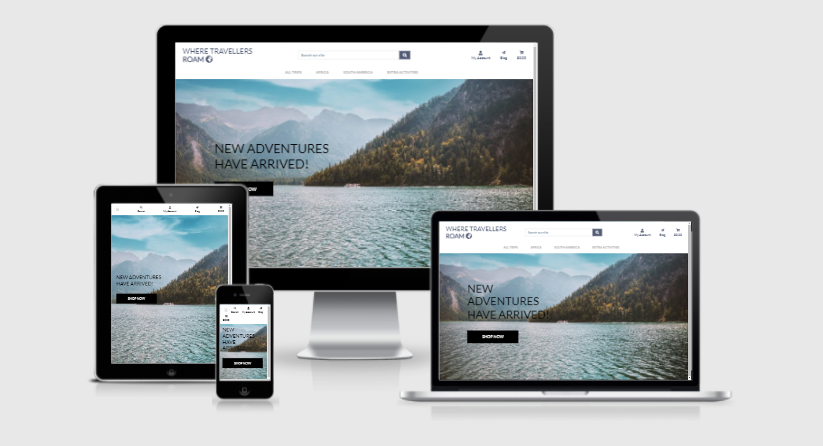
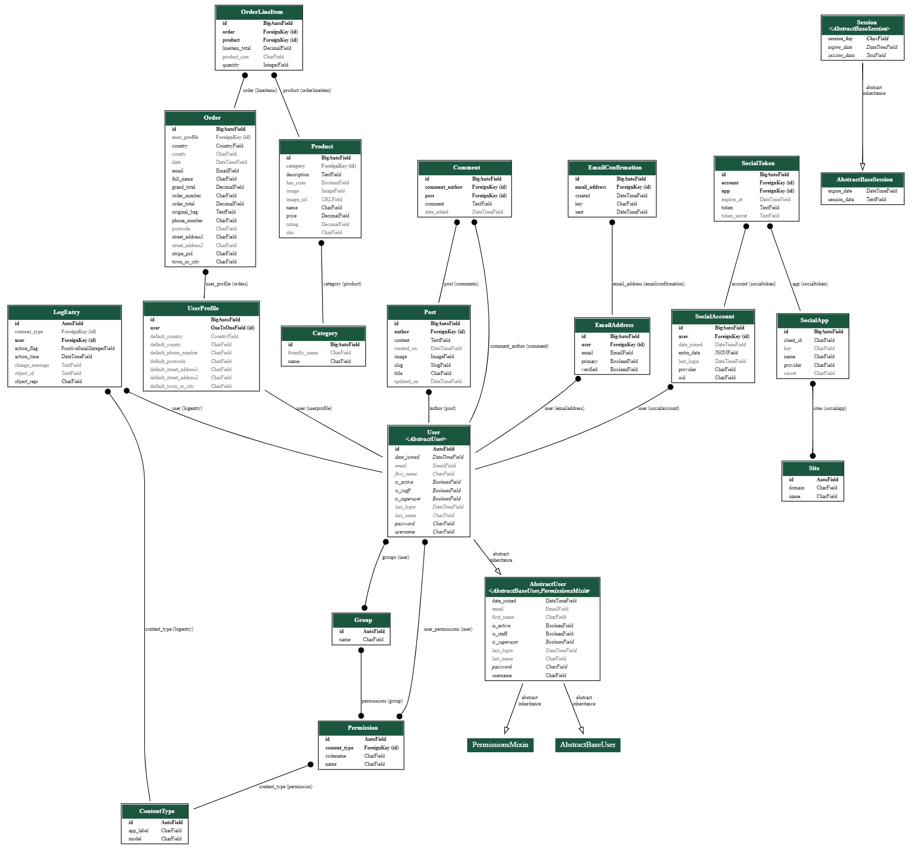

# Where Travellers Roam

## About

**Where Travellers Roam** is an a travel based site aimed at people who love to travel and explore the world, and gives them the ability to to purchase and allows them to leave blog posts of their adventures with the company and find inspiration for their next holiday. The site is designed to be responsive and easy to navigate on a range of devices to make it easily accessible for all users. 

This site was built for educational reasons and no purchases will be fulfilled. 

Link to [live site](https://where-travelers-roam.herokuapp.com/)

## Table of Contents
1. [**UX**](#ux)
    - [**User Stories**](#user-stories)
    - [**Design**](#design)
    - [**Wireframes**](#wireframes)

2. [**Features**](#features)
    - [**Current Features**](#current-features)
    - [**Future Features**](#future-features)

3. [*Database*](#database)
    - [**Database choice**](#db-choice)
    - [**Database structure**](#db-structure)

4. [T**echnologies Used**](#tech)
    - [**Languages**](#languages)
    - [**Frameworks & libraries**](#libraries)
    - [**Databases**](#db)
    - [**Tools**](#tools)

5. [**Testing**](#testing)

6. [**Deployment**](#deployment)
    - [**Heroku Deployment**](#depl-heroku)
    - [**Local Deployment (GitPod)**](#depl-gitpod)

7. [**Credits**](#credits)
    - [**Content**](#content)
    - [**Media**](#media)
    - [**Code**](#code)
    - [**Acknowledgements**](#ack)

# **UX**

**Project definition**
- “Where Travellers Roam" is a unique travel agency that organizes trips to multiple destinations with the focus on experience and enjoyment. 
- The purpose of this web app is to provide customers who would like to travel with an online platform where they can book and explore different potential destinations easily. 
- Users can browse for all the trips that are offered by the travel agency. 
- Different types of trips are offered according to the type of client. 

**Project Characters**
- Individuals – the agency offers recreational trips for individuals.
- Groups - the agency offers group holiday and activities for families and friends.

## **User Stories**

As a user, I expect:
1. To have convenient access to all the trips that the travel agency offers.
2. The website to have a neat and elegant design with an optimal architecture and layout.
3. The website to be intuitive and easy to navigate so that I can find what I need in the most effective manner.
4. To easily find information i.e. identify key information for a specific trip and, if needed, be able to access more details.
5. To be able to research trips by destination,
6. To read blogs from previous passengers and have access to to profiles and comments. 
7. To be able to book a trip and then register/log in to an account with minimal steps to confirm my order.
8. The website to display my order details for each steps of the checkout and receive an email once my booking has been completed. 
9. The website to be fully responsive on any devices: mobile, tablet, desktop. 
10. The website to be fully interactive so that I get clear feedback on any action I undertake (complete a form, process a payment, log in, log out etc…).
11. As a business or scientist, I want to easily find information on the application process and request information to the company.
12. As a client, I want to be able to access (and update) my personal information, and view my previous bookings.

## **Design**

### Theme

I wanted to create a website that would "bring" the user to to a fresh cultural enviroment. I wanted to keep it classy and professional as well. I have tried to put some efforts on selecting visually impacting pictures to entice clients to purchase more holidays. 

### Colors

The three main colors were used throughout this project.

1. White - `#fff`
    - Background
    - Navbar
2. Black - `#161616`
    - background
    - text
3. Blue - `#525b76`
    - Text
    - Links
    - Some icons

### **Typography**

- The primary font family is [Nunito](https://fonts.google.com/specimen/Lato) from Google Fonts.

## **Wireframes**

I have used Balsamiq to create my wireframes. I first brainstormed on the structure and then created the site map. There are some differences with the final project as these wireframes were created during the preparation phase. 

- [Home](media/Readme/Wireframe-home.png)
- [Blog](media/Readme/Wireframe-blog.png)
- [Products](media/Readme/Wireframe-products.png)
- [Login](media/Readme/Wireframe-login.png)
- [Bag](media/Readme/Wireframe-bag.png)
- [Checkout](media/Readme/Wireframe-checkout.png)
- [Profile](media/Readme/Wireframe-profile.png)

# **Features**

## **Current Features**

###### Features on every page
- Fixed navigation bar with:
    - on the left: Company Name
    - in the middle: links to the different pages (All trips, Africa, South America, Extra activities)
    - on the right: links for account pages and bag

###### Feature 1 - Home page
Home page with:
- innovative concept of the travel company
- categories of trips (individuals & and different categories)
- Inviting background to justify travelling
- button to browse trips

###### Feature 2 - Extra Activities page
A similar page to the products page nbut inviting guests to purchase extra activities along with there holidays.

###### Feature 3 - Africa page
A page hosting all the trips and activities specified to this particular continent.

###### Feature 4 - South America page
A page hosting all the trips and activities specified to this particular continent.

###### Feature 5 - Trips by destination page
Presentation of all the destinations available. For each destination, the following information is provided:
- trip name
- trip rating out of 5
- trip tag explaining which continent and if its an activity.
- trip price (in dollars)
- button to access the trip details

###### Feature 6 - Trips details
Description page for a specific destination. The page should display:
- high-quality picture of the destination
- trip information (duration, price, and what happens during the trip)
- Price
- Quantity per person for multiple bookings

###### Feature 7 - Bag page
The shopping bag is available anywhere in the site. The bag page should display all the trips in the user's bag. For each item in the bag, the following information should be available:
- trip destination
- Quantity
- Rating of the trip
- total price of the Bag
- Reccomendations to reach the Discount threshold of 2000$
- Discount applied if Discount threshold is reached
- button to checkout

###### Feature 8 - Checkout
Checkout process step by step with the following pages:
- (log in / sign up if the user is not logged in yet)
- contact details form
- payment form
- confirmation of order booked
- email verification
- Discount applied approval
- for each step of the checkout process, a recap of the bag is available as well as a return button to get back to the previous step. 

###### Feature 9 - Sign up page
Sign up form to register to an account.

###### Feature 10 - Login page
Form to log in to your account.

###### Feature 11 - Profile page
Profile page for users with an account that should display their:
- passenger details
- contact details
- Order history

###### Feature 12 - Log out 

## **Future Features** 

###### About us page

A page dedicated to explaining the companys origins and how we help our customers have the best trips and experiences possible.

###### Multiple more Continents to book holidays

I want to create more continents for users to book holiday and activities to so they can experience more of the world.

###### Create contact us page

The website feels empty without the ability for customers to contact the site owners, so i would like to create a page dedicated to contacting and asking questions if customers ever feel the need to.

# **Database**

## **Database choice**

- Development: I used sqlite3 database which is the default database provided by Django. 
- Production: I used PostgreSQL for my deployed application hosted on Heroku. 

## **Database structure**

The database uses SQL through PostgreSQL and was originally formed from a db.json file in the code. 

The Database schema is below and was create with help from django_extensions and the instructions from my mentor [Dataschema-Instructions](https://medium.com/@yathomasi1/1-using-django-extensions-to-visualize-the-database-diagram-in-django-application-c5fa7e710e16)

# **Technologies Used**

## **Languages**

##### [HTML5](https://www.w3.org/TR/html/)
- I used HTML to create the static content of my website.
- The following [code validator](https://validator.w3.org/) was used to test my HTML code.

##### [CSS3](https://www.w3.org/Style/CSS/)
- I used CSS to style my website and personalize it.  
- The following [code validator](https://jigsaw.w3.org/css-validator/) was used to test my CSS code.

##### [JavaScript](https://developer.mozilla.org/en-US/docs/Web/JavaScript)
- I used core JS to help develop my site with js and Jquery from bootstrap.
- [JSHint](https://jshint.com/) was used to check my JS code quality.

##### [Python 3](https://www.python.org/downloads/release/python-374/)
- I used Python 3 as the back-end programming language for my application. I used Pythons Black Formatter recommended by my mentor to help solve the pep8 compliance with my code. This is doenloaded through the extensions hub in gitpod.

## **Frameworks & Libraries**

##### [Django 3](https://www.djangoproject.com)
- I used Django 3 as Python framework to build this website. 

##### [Bootstrap](https://getbootstrap.com/)
- I used Bootstrap as the main framework for HTML.

##### [jQuery](https://jquery.com/) 
- I used jQuery to simplify the DOM manipulation.

##### [Font Awesome](https://origin.fontawesome.com/)
- I used Font Awesome to display icons.

##### [Google Fonts](https://fonts.google.com/)
- I used google fonts for my main font families.

## **Databases**

##### [SQLite3](https://www.sqlite.org/releaselog/3_32_3.html)
- I used sqlite as database during the development stage.

##### [PostgreSQL](https://www.postgresql.org/)
- I used PostgreSQL as database in production. 

## **Tools**

##### [Balsamiq](https://balsamiq.com/) 
- I used Balsamiq to design my wireframes.

##### [Gitpod](https://gitpod.io/)
- I used Gitpod as my IDE for this project.

##### [Amazon S3](https://aws.amazon.com/s3/)
- I used Amazon Simple Storage Service to store my static and media files.

##### [Stripe](https://stripe.com/)
- I used Stripe for secure credit card payment validation.

##### [Git & GitHub](https://github.com/)
- I used Git for version control. 
- I used GitHub to store my code in a remote repository.

##### [Heroku](https://dashboard.heroku.com)
- I used Heroku to deploy and host my application.

# **Testing** 

All the documentation regarding the testing of this project can be found in this [TESTING.md](media/Readme/TESTING.md) file.

Note: to test the card payment (hosted by Stripe) on the checkout page, the following should be used:

Card number: 4242 4242 4242 4242
Exp date: 04/24
CVC: 242
ZIP: 42424

# **Deployment**

## **Heroku**

My application was deployed through [heroku](https://dashboard.heroku.com) using the master branch of my github repository for this project. The following steps were implemented to deploy this project:

1. Install **gunicorn** package to run the application on Heroku.
    - `sudo pip3 install gunicorn`
2. Install **pycopg2** to connect to PostgreSQL
    - `sudo pip3 install psycopg2`
3. Create a **requirements.txt** file
    - `sudo pip3 freeze --local > requirements.txt`
4. Create a new Heroku application
    - Sign up to a new account if you do not already have one.
    - Create a new application by clicking on `new` then `create new app`.
    - Set the name of your application and select your region and click on `create app` to finalize the creation of your app. 
5. Install PostgreSQL add-on
    - `heroku addons:create heroku-postgresql:hobby-dev`
6. Create a **Procfile** in the root directory
    - content: `web: gunicorn spacex.wsgi:application`
7. Set the following config variables as environment variables:

Config Vars | Value
----------- | -------------
AWS_ACCESS_KEY_ID | `<AWS_ACCESS_KEY_ID>`
AWS_SECRET_ACCESS_KEY | `<AWS_SECRET_ACCESS_KEY>`
DATABASE_URL | `<DATABASE_URL>`
EMAIL_HOST_PASS | `<EMAIL_HOST_PASS>`
EMAIL_HOST_USER | `<EMAIL_HOST_USER>`
SECRET_KEY | `<SECRET_KEY>`
STRIPE_PUBLISHABLE | `<STRIPE_PUBLISHABLE>`
STRIPE_SECRET_KEY | `<STRIPE_SECRET_KEY>`
STRIPE_PUBLIC_KEY | `<STRIPE_PUBLIC_KEY>`
STRIPE_WH_SECRET | `<STRIPE_WH_SECRET>`
USE_AWS | `<TRUE>`

5. In the `Deploy` tab, choose `Connect Github` as **Deployment Method** and *Enable Automatic Deployment* from the Github master branch so that any new commit will be automatically deployed through your heroku app. 

## **Local Deployment (GitPod)**

To deploy this project locally using gitpod you will have to create a gitpod account and use a web browser with a stable internet connection as gitpod is an online IDE. I suggest you use Chrome as web browser so that you can use gitpod chrome extension to speed up the deployment process. 

1. Create a Gitpod account (if not already)
    - Go to [GitPod](https://www.gitpod.io)
    - Click on `Go to App` and click on the green `Authorize gitpod.io`
    - Agree to the terms and then create your free account
2. Add gitpod browser extension for Chrome:
    - Go to [GitPod Chrome Browser Extension](https://chrome.google.com/webstore/detail/gitpod-online-ide/dodmmooeoklaejobgleioelladacbeki)
    - Search for "gitpod" in chrome web store search bar
    - Click on `Add to Chrome` then click on `Add to extension`
3. Clone this project repository from github
    - Go to my [repository](https://github.com/AlexiaDelorme/project-spacex) for this project.
    - If you successfully installed the gitpod browser extension you should view a green `Gitpod` button in the top right corner of the repository (next to `Clone or download` button). Click the `Gitpod` button. 
    - This will allow you to open this repository directly in gitpod for editing.
4. Set the following environment variables for the project:

Env Vars | Value
----------- | -------------
AWS_ACCESS_KEY_ID | `<AWS_ACCESS_KEY_ID>`
AWS_SECRET_ACCESS_KEY | `<AWS_SECRET_ACCESS_KEY>`
DATABASE_URL | `<DATABASE_URL>`
EMAIL_HOST_PASS | `<EMAIL_HOST_PASS>`
EMAIL_HOST_USER | `<EMAIL_HOST_USER>`
SECRET_KEY | `<SECRET_KEY>`
STRIPE_PUBLISHABLE | `<STRIPE_PUBLISHABLE>`
STRIPE_SECRET_KEY | `<STRIPE_SECRET_KEY>`
STRIPE_PUBLIC_KEY | `<STRIPE_PUBLIC_KEY>`
STRIPE_WH_SECRET | `<STRIPE_WH_SECRET>`

5. The default local database for django projects is SQLite 3.
6. Download all the dependencies necessary to run this project and listed in the **requirements.txt** file. 
    - Run the following command `pip3 install -r requirements.txt`
7. Create a local development server:
    - In the workspace run the following command `Python3 manage.py runserver`.
    - You should now have a gitpod link to the deployed app. 

# **Credits**

### **Media**

- All the images used for this project were found on [Pixabay](https://pixabay.com/) a free image website..
- I used [Font Awesome](https://fontawesome.com/v4.7.0/icons/) for my icons.
- Demo picture of my app used in this README file: [Am I Responsive](http://ami.responsivedesign.is/#)

### **Code**
- My mentor helped me through some of the logic code revolving around the discount threshold and applying it across the checkout and bag.
- [Django Email](https://stackoverflow.com/questions/2809547/creating-email-templates-with-django)
- [Corey Schafer's Django Tutorials](https://www.youtube.com/playlist?list=PL-osiE80TeTtoQCKZ03TU5fNfx2UY6U4p)

### **Acknowledgements**
- My Code Institute mentor, Reuben fer, for his patience and great support throughout this project.
- The entire team of tutors at Code Institute for their guidance and patience. 
- Everyone in slack for tackling my non-stop questions.